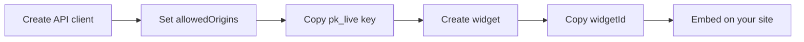

The **widget registry** stores layout configuration for each embed. Integrators reference a widget by `widgetId`; the backend returns reviews, rating data, and dashboard settings in one call.

## Setup flow



### 1. Create an API client

In the dashboard: **Integrations → API Clients → Create**.

- Set **allowedOrigins** to every domain that will host the widget
- Copy the **publishable key** (`pk_live_*` or `pk_test_*`)

### 2. Create a widget

**Integrations → Widgets → Create**.

| Field | Purpose |
| ----- | ------- |
| **Name** | Internal label |
| **Type** | `BADGE`, `CAROUSEL`, `TESTIMONIAL`, `GRID`, or `LIST` — maps to a default layout |
| **Environment** | Must match your API client (`PRODUCTION` or `SANDBOX`) |
| **Min stars** | Lowest rating to include (default 4) |
| **Config** | Optional JSON — set `layout` to override the default (e.g. `"trust-score"`) |

Copy the **widget ID** from the widget detail page.

### 3. Embed on your site

**React (recommended):**

```tsx
import { ReviewWidget } from "@ethioreview/review-widget-react";
import "@ethioreview/review-widget-react/styles.css";

<ReviewWidget
  baseUrl="https://api.ethioreview.com"
  publicKey="pk_live_YOUR_KEY"
  widgetId="YOUR_WIDGET_ID"
/>
```

**Web Component:**

```html
<script async src="https://cdn.ethioreview.com/widget/v1/review-widget.js"></script>
<review-widget
  data-base-url="https://api.ethioreview.com"
  data-public-key="pk_live_YOUR_KEY"
  data-widget-id="YOUR_WIDGET_ID"
></review-widget>
```

## Resolve endpoint

`GET /api/v1/widgets/resolve/{widgetId}` returns:

- Widget metadata (`type`, `minStars`, `config`)
- Paginated reviews
- `ratingSummary` with star distribution

Auth: `X-Widget-Key` header with your publishable key.

## Widget type → layout mapping

| Dashboard type | Default layout |
| -------------- | -------------- |
| `BADGE` | Micro badge |
| `TESTIMONIAL` | Review carousel |
| `CAROUSEL` | Review carousel |
| `GRID` | Review carousel |
| `LIST` | Default list |

Override with `config.layout` in the dashboard or the React `layout` prop.

## Generate embed snippet

Use `buildReactEmbedSnippet` from `@ethioreview/review-widget-core`:

```ts
import { buildReactEmbedSnippet } from "@ethioreview/review-widget-core";

const snippet = buildReactEmbedSnippet({
  baseUrl: "https://api.ethioreview.com",
  publicKey: "pk_live_YOUR_KEY",
  widgetId: "YOUR_WIDGET_ID",
  useEnvVars: true,
});
```

[Credentials →](/integrations/widget/credentials) · [React embed →](/integrations/widget/embed-react)
